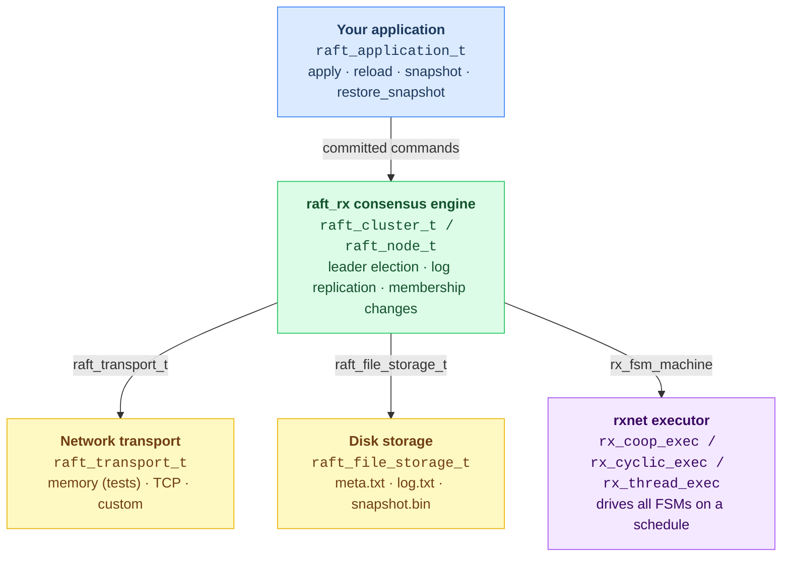

# raft_rx - C User Guide

---

# Part I — The Library

---

## 1. Overview

`raft_rx` is a C library that implements the
[Raft consensus algorithm](https://raft.github.io/) on top of the `rxnet`
reactive-synchronous runtime.  It provides:

- **Replicated state machine** — commands are appended to a distributed log,
  committed by majority quorum, and applied to your application in strict order.
- **Leader election** — automatic election with randomised timeouts; the
  cluster self-heals after a leader failure with no operator intervention.
- **Membership changes** — safe joint-consensus reconfiguration; nodes can be
  added or removed while the cluster is running.
- **Persistent storage** — term, log, snapshot, and membership configuration
  survive process restarts.
- **Pluggable transport** — swap the built-in in-memory transport for TCP (or
  any other medium) by implementing five function pointers.
- **Pluggable application** — implement four callbacks to connect your own
  state machine; the library is otherwise agnostic to what the commands mean.

---

## 2. Architecture



| Layer | Type | Responsibility |
|---|---|---|
| **Application** | `raft_application_t` | Your state machine — what commands mean |
| **Consensus engine** | `raft_cluster_t` / `raft_node_t` | Raft protocol: leader election, log replication, membership |
| **Transport** | `raft_transport_t` | Send/receive messages between nodes |
| **Storage** | `raft_file_storage_t` | Durable persistence of Raft state |
| **Runtime** | `rx_*_exec` | Cooperative/cyclic/thread scheduling of all FSMs |

---

## 3. Key concepts

### Roles

Every node is always in exactly one of three roles:

| Role | Description |
|---|---|
| **Follower** | Passive; accepts log entries replicated by the leader |
| **Candidate** | Running for election after the election timeout expires |
| **Leader** | Accepts client commands, replicates them, commits when quorum reached |

### Log, terms, and commit

- Each client command becomes a **log entry** with fields `(index, term, command)`.
- The leader replicates entries to a quorum of nodes, then marks them **committed**.
- Committed entries are applied to every node's application in index order via `apply`.
- A **term** is a monotonically increasing counter that advances with each
  election — the Raft equivalent of a logical clock.

### Membership configuration

`raft_rx` tracks which nodes form the authoritative quorum as
`raft_cluster_configuration_t`:

```c
typedef struct {
    char   old_members[RAFT_MAX_NODES][RAFT_MAX_ID]; /* current or leaving set */
    size_t old_count;
    char   new_members[RAFT_MAX_NODES][RAFT_MAX_ID]; /* joining set (joint only) */
    size_t new_count;
    int    index;   /* log index where this config was written */
} raft_cluster_configuration_t;
```

`old_count > 0, new_count == 0` means **stable** configuration.  
`old_count > 0, new_count > 0` means **joint** configuration (transition in progress).

The configuration is persisted in `meta.txt` and replayed on restart.

---

## 4. Implementing your application

### 4.1 The application interface

Connect your state machine to the consensus engine by filling in four callbacks:

```c
typedef struct {
    void   (*apply)            (void *user, const raft_command_t *command);
    void   (*reload)           (void *user);
    size_t (*snapshot)         (void *user, void *buf, size_t buf_size);
    void   (*restore_snapshot) (void *user, const void *buf, size_t size);
    void  *user;
} raft_application_t;
```

A command is a fixed-size triple of C strings that the library treats as opaque:

```c
typedef struct {
    char op   [32];              /* operation name — "set", "del", "inc", … */
    char key  [RAFT_MAX_KEY];    /* primary key     (max 63 chars)           */
    char value[RAFT_MAX_VALUE];  /* payload / value (max 127 chars)          */
} raft_command_t;
```

| Callback | When it is called | What you must do |
|---|---|---|
| `apply` | Once per committed log entry, in index order | Mutate your state — this is the only place you should do so |
| `reload` | Restart with no snapshot on disk | Reset to the empty state; the engine re-applies the full log via `apply` |
| `snapshot` | Log compaction | Serialise your current state into `buf` (max `buf_size` bytes); return bytes written |
| `restore_snapshot` | Restart with a snapshot on disk | Deserialise `buf` into your state; the engine then re-applies any log entries that follow |

> **Correctness rule**: `apply` is called exactly once per entry, always on the
> rxnet compute thread.  Do **not** mutate your state outside of `apply`, and do
> **not** spawn threads inside it.

> **Snapshot size**: The snapshot buffer is `RAFT_MAX_SNAPSHOT_SIZE` bytes
> (default 4096).  Override it before including `raft.h` if your state is
> larger:
> ```c
> #define RAFT_MAX_SNAPSHOT_SIZE (256 * 1024)
> #include "raft/raft.h"
> ```

### 4.2 Example: replicated counter

```c
typedef struct { int counter; } my_state_t;

static void my_apply(void *user, const raft_command_t *cmd) {
    my_state_t *s = (my_state_t *)user;
    if (strcmp(cmd->op, "inc") == 0)
        s->counter += atoi(cmd->value);
    else if (strcmp(cmd->op, "reset") == 0)
        s->counter = 0;
}

static void my_reload(void *user) {
    ((my_state_t *)user)->counter = 0;  /* reset; log replay rebuilds state */
}

static size_t my_snapshot(void *user, void *buf, size_t buf_size) {
    int n = snprintf((char *)buf, buf_size, "%d\n",
                     ((my_state_t *)user)->counter);
    return (n > 0 && (size_t)n < buf_size) ? (size_t)n : 0;
}

static void my_restore_snapshot(void *user, const void *buf, size_t size) {
    (void)size;
    ((my_state_t *)user)->counter = atoi((const char *)buf);
}

raft_application_t my_make_app(my_state_t *s) {
    raft_application_t app;
    app.apply            = my_apply;
    app.reload           = my_reload;
    app.snapshot         = my_snapshot;
    app.restore_snapshot = my_restore_snapshot;
    app.user             = s;
    return app;
}
```

---

## 5. Setting up the cluster

### 5.1 Create the runtime and cluster

```c
rx_fsm_runtime runtime;
raft_cluster_t cluster;

/* capacity = total number of rx_fsm_machines you will register
 * (one per Raft node + one per auxiliary FSM such as a CLI or sensor reader) */
rx_fsm_runtime_init(&runtime, 2);
raft_cluster_init(&cluster, &runtime);
raft_cluster_enable_realtime_clock(&cluster);  /* use wall-clock time */
```

### 5.2 Configure the node

```c
raft_node_config_t cfg;
memset(&cfg, 0, sizeof(cfg));

strncpy(cfg.node_id, "n1", RAFT_MAX_ID - 1);
cfg.election_timeout_ms   = 500;   /* base timeout before starting election */
cfg.heartbeat_interval_ms = 100;   /* leader sends heartbeats at this rate  */

/* IDs of the other nodes this node will talk to.
 * The transport uses these to route outgoing messages. */
strncpy(cfg.peers[0], "n2", RAFT_MAX_ID - 1);
strncpy(cfg.peers[1], "n3", RAFT_MAX_ID - 1);
cfg.peer_count = 2;

/* IDs of ALL nodes in the initial cluster — must be identical on every node.
 * Leave empty (initial_member_count = 0) for nodes joining an existing cluster. */
strncpy(cfg.initial_members[0], "n1", RAFT_MAX_ID - 1);
strncpy(cfg.initial_members[1], "n2", RAFT_MAX_ID - 1);
strncpy(cfg.initial_members[2], "n3", RAFT_MAX_ID - 1);
cfg.initial_member_count = 3;
```

### 5.3 Add the node to the cluster

```c
my_state_t state = {0};
raft_application_t app = my_make_app(&state);

/* root_dir: the engine stores node state under {root_dir}/{node_id}/
 * Pass NULL to disable persistence (useful in tests). */
raft_node_t *node = raft_cluster_add_node(&cluster, &cfg,
                                          "var/myapp",  /* root_dir */
                                          &app,
                                          10000);        /* tick period µs */
```

---

## 6. Choosing a transport

### 6.1 Memory transport (in-process — tests and simulations)

All nodes share the same `raft_cluster_t`.  No threads, no network.

```c
node->transport = raft_mem_transport_make(node);
```

Use `raft_cluster_tick(cluster, dt_ms)` to drive time manually, which is
convenient for deterministic tests:

```c
for (int i = 0; i < 100; ++i)
    raft_cluster_tick(&cluster, 10);  /* simulate 1000 ms */
```

### 6.2 TCP transport (multi-process — production)

Each process hosts one node.  Include `raft/raft_tcp_transport.h` and add
`raft_tcp_transport.c` to your build (it is **not** in `libraft_rx.a`).

```c
raft_tcp_transport_t tcp;

raft_tcp_transport_init(&tcp, 5001);                    /* 1. listen port       */
raft_tcp_transport_set_self(&tcp, "n1", "127.0.0.1");   /* 2. own identity      */
raft_tcp_transport_set_data_dir(&tcp, "var/myapp/n1");  /* 3. load peers.txt /  */
                                                        /*    self.txt from disk */
/* Only needed on first run — persisted automatically afterwards */
raft_tcp_transport_add_peer(&tcp, "n2", "127.0.0.1", 5002);
raft_tcp_transport_add_peer(&tcp, "n3", "127.0.0.1", 5003);

raft_tcp_transport_start(&tcp);   /* 4. spawn listener thread */

node->transport = raft_tcp_transport_make(&tcp);  /* 5. attach to node */
```

Call order matters: `set_self` and `set_data_dir` must precede `start`.

Stop the transport after the event loop exits:

```c
raft_tcp_transport_stop(&tcp);
```

### 6.3 Custom transport

Implement the five-function vtable and assign it to `node->transport`:

```c
typedef struct {
    int    (*send)           (void *ctx, const raft_message_t *msg);
    size_t (*recv)           (void *ctx, raft_message_t *out, size_t capacity);
    int    (*submit_command) (void *ctx, const raft_command_t *cmd);
    size_t (*recv_commands)  (void *ctx, raft_command_t *out, size_t capacity);
    void   (*set_enabled)    (void *ctx, int enabled); /* may be NULL */
    void  *ctx;
} raft_transport_t;
```

| Function | Called by | Contract |
|---|---|---|
| `send` | Engine | Deliver `msg` to the node identified by `msg->target`; return 0 on success |
| `recv` | Engine | Copy at most `capacity` incoming messages into `out`; return count |
| `submit_command` | Your client code | Enqueue `cmd` for the leader to process; return 0 on success |
| `recv_commands` | Engine (leader only) | Drain at most `capacity` pending commands into `out`; return count |
| `set_enabled` | `raft_node_stop` / `raft_node_start` | Gate the transport; pass NULL if you do not need simulated failures |

`send` / `recv` carry `raft_message_t` (Raft protocol messages).  
`submit_command` / `recv_commands` carry `raft_command_t` (application commands).

---

## 7. Running the event loop

Raft nodes are `rx_fsm_machine` instances driven by an rxnet executor.  Pick
the executor that fits your application:

### 7.1 Cooperative executor

Single-threaded, polls continuously, sleeps between ticks.  Simplest option.

```c
#include "rxnet/coop.h"

rx_coop_exec ce;
rx_coop_exec_init(&ce);
rx_coop_exec_add(&ce, &runtime.runtime);
rx_coop_exec_run(&ce);   /* blocks until stopped */
```

### 7.2 Cyclic executive

Fixed-period scheduling driven by a sleep-until timer.  Drop-in replacement
for `rx_coop_exec`; the period is read from each machine's `period_us`.

```c
#include "rxnet/cyclic.h"

rx_cyclic_exec ce;
rx_cyclic_exec_init(&ce);
rx_cyclic_exec_add(&ce, &runtime.runtime);
rx_cyclic_exec_run(&ce);
```

### 7.3 Thread executor

One pthread per FSM node, synchronised with BSP barriers (latch / evaluate /
commit phases run in lock-step across all threads).  Suitable when the Raft
FSM and other FSMs should run in parallel.

```c
#include "rxnet/thread.h"

rx_thread_exec te;
rx_thread_exec_init(&te);
rx_thread_exec_add(&te, &runtime.runtime);
rx_thread_exec_run(&te);   /* last node of last runtime stays on main thread */
```

> With the TCP transport all shared mutable state between the listener thread
> and the compute thread is already protected by a mutex, so the thread
> executor is safe to use.

---

## 8. Submitting commands

Commands must reach the **leader** to be committed.

**Memory transport** — find the leader directly and submit:

```c
raft_node_t *leader = raft_cluster_leader(&cluster);
if (leader) {
    raft_command_t cmd;
    memset(&cmd, 0, sizeof(cmd));
    strncpy(cmd.op,    "inc", sizeof(cmd.op)    - 1);
    strncpy(cmd.value, "1",   sizeof(cmd.value)  - 1);
    raft_node_submit_command(leader, &cmd);
}
```

**TCP transport** — enqueue into the transport; the leader drains it on the
next tick:

```c
raft_command_t cmd;
memset(&cmd, 0, sizeof(cmd));
strncpy(cmd.op,    "inc", sizeof(cmd.op)    - 1);
strncpy(cmd.value, "1",   sizeof(cmd.value)  - 1);
node->transport.submit_command(node->transport.ctx, &cmd);
```

Commands submitted to a follower are silently dropped; the application is
responsible for directing commands to the leader (or forwarding them).

---

## 9. Membership changes

### 9.1 Adding a node

A joining node sets `cfg.learner = 1` (prevents it from auto-bootstrapping a
solo cluster) and leaves `initial_member_count = 0`.  With the TCP transport,
it calls `raft_tcp_transport_request_join` once at startup to contact any one
existing member (the *introducer*):

```c
cfg.learner = 1;
/* no initial_members */

/* After attaching the transport: */
raft_tcp_transport_request_join(&tcp,
    "n4", "127.0.0.1", 5004,   /* this node's identity */
    "127.0.0.1", 5001);         /* introducer address   */
```

The join protocol runs automatically:

```
n4  ──(join-request)──────────────────────► n1
n1  ──(flood: forwarded join-request)──────► n2, n3
n1, n2, n3  ──(announce-self)─────────────► n4
leader appends enter_joint / leave_joint to log
n4 is a full voting member once leave_joint commits
```

Existing nodes do **not** need reconfiguration.

### 9.2 Removing a node

Call `raft_node_request_membership_change` on the leader, passing the **target
full membership list** (not a delta):

```c
/* Remove n4: new membership is {n1, n2, n3} */
char new_members[3][RAFT_MAX_ID] = {"n1", "n2", "n3"};
raft_node_request_membership_change(leader_node, new_members, 3);
```

To remove the current node itself, exclude its own ID from the list.  The
engine runs joint consensus automatically; the removed node stops once the
final configuration commits.

### 9.3 Joint consensus internals

Membership changes use the two-phase joint consensus approach from the Raft
paper.

**Phase 1 — enter joint**: the leader appends a `cluster.enter_joint` log
entry encoding both old and new member sets.  While this entry is not yet
committed, quorum requires a majority from **both** sets.

**Phase 2 — leave joint**: once all new members have caught up and
`enter_joint` is committed, the leader appends `cluster.leave_joint`.  The
cluster transitions to the new stable configuration.

```
log: … | enter_joint [old={n1,n2,n3}, new={n1,n2,n3,n4}] | … | leave_joint [new={n1,n2,n3,n4}] | …
```

---

## 10. TCP transport — persistence

### Peer table (`peers.txt`)

Every time a peer is registered — via `raft_tcp_transport_add_peer` or through
the join protocol — the full peer table is written atomically to
`{data_dir}/peers.txt`:

```
n2 127.0.0.1 5002
n3 127.0.0.1 5003
```

`set_data_dir` reloads this file at startup, so peer addresses do not need to
be supplied again after the first run.  `add_peer` deduplicates by node ID:
adding the same ID with a new address updates the entry and rewrites the file.

### Own address (`self.txt`)

`raft_tcp_transport_start` writes `{data_dir}/self.txt`:

```
127.0.0.1 5001
```

`set_data_dir` reads it at startup and fills in `own_host` and `listen_port`
if they are not already set by the caller.  Priority (highest wins):

1. Explicit value passed by the caller (`init` port, `set_self` host)
2. Values read from `self.txt`
3. Defaults (`127.0.0.1`, port 0 — no listening)

All writes use an atomic write-to-temp / rename pattern so a crash mid-write
never corrupts the live file.

---

## 11. Persistence and storage format

Each node stores its state under `{root_dir}/{node_id}/`:

```
var/myapp/
└── n1/
    ├── meta.txt        Raft durable state (term, voted_for, config, …)
    ├── log.txt         Log entries not yet compacted into a snapshot
    ├── snapshot.bin    Compacted application state
    ├── peers.txt       Known TCP peer addresses   (TCP transport only)
    └── self.txt        Own host and listen port   (TCP transport only)
```

### `meta.txt`

Plain text, one `key value` pair per line:

```
current_term 7
voted_for n2
compaction_threshold 128
commit_index 14
snapshot_last_included_index 10
snapshot_last_included_term 4
configuration_index 3
old_count 3
old_member n1
old_member n2
old_member n3
new_count 0
```

### `log.txt`

One entry per line, pipe-delimited `index|term|op|key|value`:

```
11|4|set|foo|bar
12|4|del|old|-
13|7|cluster.enter_joint|members|n1,n2,n3,n4
14|7|cluster.leave_joint|members|n1,n2,n3,n4
```

### `snapshot.bin`

Binary: `[int32 index][int32 term][int32 size][<size> bytes of application data]`

The application data is whatever your `snapshot` callback writes.  The engine
validates `index` and `term` on load before passing the bytes to
`restore_snapshot`.

---

## 12. Configuration reference

### `raft_node_config_t`

| Field | Type | Description |
|---|---|---|
| `node_id` | `char[RAFT_MAX_ID]` | Unique node name (max 15 chars) |
| `peers` / `peer_count` | `char[][RAFT_MAX_ID]` / `size_t` | IDs of the other nodes |
| `initial_members` / `initial_member_count` | `char[][RAFT_MAX_ID]` / `size_t` | IDs of all nodes in the initial cluster |
| `learner` | `int` | `1` for a joining node — skips auto-bootstrap |
| `election_timeout_ms` | `int` | Base follower election timeout |
| `heartbeat_interval_ms` | `int` | Leader heartbeat interval |

### Timing guidelines

| Parameter | Recommended | Minimum | Notes |
|---|---|---|---|
| `election_timeout_ms` | 500 ms | 3–5 × RTT | Too small: spurious elections; too large: slow failover |
| `heartbeat_interval_ms` | 100 ms | ~RTT | Rule of thumb: at most 1/5 of `election_timeout_ms` |
| tick `period_us` | 10 000 µs | — | Keep at most `heartbeat_interval_ms × 1000 / 2` |

### Restart behaviour

A node that has `current_term > 0` on disk (i.e. has participated in at least
one election) gets an extra `2 × election_timeout_ms` added to its first
election deadline.  This window gives the existing leader time to send
heartbeats before the restarting node launches a new election.

---

## 13. Limits reference

| Constant | Default | Override? | Meaning |
|---|---|---|---|
| `RAFT_MAX_NODES` | 8 | Yes | Maximum nodes per cluster |
| `RAFT_MAX_PEERS` | 7 | Yes | Maximum peers per node (= `RAFT_MAX_NODES - 1`) |
| `RAFT_MAX_ID` | 16 | Yes | Node ID buffer size including `\0` |
| `RAFT_MAX_LOG` | 128 | Yes | Log entries kept before compaction is forced |
| `RAFT_MAX_QUEUE` | 256 | Yes | Message queue depth (per node, per direction) |
| `RAFT_MAX_BATCH` | 16 | Yes | Max entries per `AppendEntries` RPC |
| `RAFT_MAX_KEY` | 64 | Yes | `raft_command_t.key` buffer size |
| `RAFT_MAX_VALUE` | 128 | Yes | `raft_command_t.value` buffer size |
| `RAFT_MAX_SNAPSHOT_SIZE` | 4096 | Yes | Snapshot buffer in bytes |
| `RAFT_KV_MAX_PAIRS` | 128 | Yes | Pairs in the built-in KV application |

Override any constant before including `raft.h`, consistently across all
translation units:

```c
#define RAFT_MAX_NODES 16
#define RAFT_MAX_SNAPSHOT_SIZE (256 * 1024)
#include "raft/raft.h"
```

---

## 14. Building

### Library

```bash
make -C c build/libraft_rx.a          # standard build
make -C c build/libraft_rx_trace.a    # with rxnet tracing (-DRX_TRACE_ENABLE)
```

### Linking your application

```makefile
INCLUDES := -Ic/include -Irxnet/c/include
LIBS     := c/build/libraft_rx.a rxnet/c/build/librxnet.a -lpthread

$(TARGET): $(SRC) $(LIBS)
	$(CC) -std=c99 -O2 $(INCLUDES) -o $@ $(SRC) $(LIBS)
```

`libraft_rx.a` contains `raft.c`, `raft_transport.c`, and `raft_storage.c`.
The following are **not** included and must be compiled directly into your
binary if you use them:

| File | When needed |
|---|---|
| `src/raft_tcp_transport.c` | When using the TCP transport |
| `src/raft_kv_app.c` | When using the built-in key-value application |

### Minimal example

```bash
cc -std=c99 -O2 \
   -Ic/include -Irxnet/c/include \
   my_app.c \
   c/build/libraft_rx.a rxnet/c/build/librxnet.a \
   -o my_app
```

---

## 15. Troubleshooting

### No leader elected after startup

- Verify that all nodes declare the **same** `initial_members` list.
- Check that peer addresses are reachable and ports are open.
- Ensure `election_timeout_ms` is at least 3–5 × the round-trip latency.

### Compaction / snapshot

Compaction triggers automatically when the log reaches
`compaction_threshold` entries (default: `RAFT_MAX_LOG = 128`).  The engine
calls `snapshot`, writes `snapshot.bin`, and truncates `log.txt`.  Verify that
your `snapshot` callback serialises **all** state, otherwise a restart after
compaction will miss entries that were already compacted.

### `raft_cluster_add_node` returns NULL

- The cluster is already at `RAFT_MAX_NODES` capacity.
- The data directory cannot be created (check permissions).

---

# Part II — The Demo Application

---

## 16. Overview

`c/examples/demo_app` is a **worked example** that shows how to build a
multi-process Raft cluster using `raft_rx`.  It implements a replicated
key-value store with a readline CLI.

It is **one possible application** of the library, not the library itself.
Read Part I to understand the underlying API; read this part to see it in
action and to use the `raft_node` binary for experimentation.

### What the demo app adds on top of raft_rx

| Concern | How the demo app handles it |
|---|---|
| State machine | Built-in key-value store (`raft_kv_app`) |
| Transport | TCP (`raft_tcp_transport`) |
| Executor | `rx_coop_exec` (cooperative, single thread) |
| Command routing | Follower forwards commands to leader via TCP |
| CLI | `rx_fsm_machine` on the same runtime as the Raft node |
| Argument parsing | Custom `--id`, `--port`, `--member`, `--peer`, `--join` flags |

### Source layout

```
c/examples/demo_app/
├── Makefile
├── README.md
└── src/
    ├── main.c      argument parsing, setup, rx_coop_exec_run
    ├── cli_fsm.h   CLI state definition
    └── cli_fsm.c   CLI FSM implementation
```

---

## 17. Building

```bash
make -C c/examples/demo_app
# Result: c/examples/demo_app/build/raft_node
```

---

## 18. Starting a fresh cluster

All nodes in the initial cluster must agree on the same member list.  Provide
`--member ID` once per node and `--peer ID=HOST:PORT` for every other node.

```bash
# Terminal 1
./build/raft_node --id n1 --port 5001 \
  --member n1 --member n2 --member n3 \
  --peer n2=127.0.0.1:5002 --peer n3=127.0.0.1:5003

# Terminal 2
./build/raft_node --id n2 --port 5002 \
  --member n1 --member n2 --member n3 \
  --peer n1=127.0.0.1:5001 --peer n3=127.0.0.1:5003

# Terminal 3
./build/raft_node --id n3 --port 5003 \
  --member n1 --member n2 --member n3 \
  --peer n1=127.0.0.1:5001 --peer n2=127.0.0.1:5002
```

After ~1 s a leader is elected.

---

## 19. Restarting a node

All state (term, log, snapshot, peers, port, host) is persisted under
`var/raft/{id}/` after the first run.  Restart with only `--id`:

```bash
./build/raft_node --id n1
```

The cluster does **not** need to be stopped.  A 3-node cluster tolerates one
offline node and stays fully operational while it restarts.

---

## 20. Adding a node

The joining node contacts any one existing member (`--join HOST:PORT`).  It
does **not** need `--member` or `--peer`:

```bash
./build/raft_node --id n4 --port 5004 --join 127.0.0.1:5001
```

The introducer floods the request to all peers, each peer announces itself to
the new node, and the leader applies the membership change via Raft.  Existing
nodes require no reconfiguration.

---

## 21. Removing a node

Use `rmnode` on whichever node is the current leader, or `leave` on the node
that wants to exit:

```
n1> rmnode n4    # remove n4 (any node can issue this; only the leader acts)
n4> leave        # n4 removes itself
```

---

## 22. CLI reference

### Key-value commands

| Command | Description |
|---|---|
| `set KEY VALUE` | Replicated write — forwarded to the leader automatically if this node is a follower |
| `get KEY` | Read from the **local** KV state (no consensus required) |
| `delete KEY` | Replicated delete — forwarded to the leader if needed |

### Cluster inspection

| Command | Description |
|---|---|
| `status` | Role, term, leader ID, commit index, log size, per-peer match index (leader only) |
| `leader` | Current leader node ID |
| `members` | Membership configuration — `stable` or `joint [old] [new]` |
| `log` | Full Raft log with `COMMITTED` / `UNCOMMITTED` markers per entry |

### Cluster management

| Command | Who can run it | Description |
|---|---|---|
| `addnode ID` | Any node | Add `ID` to the cluster; forwarded to the leader automatically |
| `rmnode ID` | Any node | Remove `ID` from the cluster; forwarded to the leader automatically |
| `leave` | Any node | This node removes itself; forwarded to the leader if needed, then exits |
| `join HOST:PORT` | Any node | If currently a member, leaves first; then joins the cluster via the node at `HOST:PORT` as introducer (equivalent to `--join` at startup, but usable at runtime) |
| `merge HOST:PORT` | Any node | **Cluster merge** — see below |
| `port PORT` | Any node | Start listening on `PORT` (useful when the node was started without `--port`) |

### Fault injection

| Command | Description |
|---|---|
| `stop` | Halts Raft processing on this node (simulates a crash without killing the process) |
| `start` | Resumes after `stop` |

### `merge HOST:PORT` — cluster merge protocol

`merge` connects **two independent clusters** into one.  It is fundamentally
different from `join`, which adds a single new node:

- **`join`** — one node introduces itself to an existing cluster.
- **`merge`** — this cluster introduces all of its members (with their TCP
  addresses) to the node at `HOST:PORT`, which belongs to a different cluster.

**Protocol** (initiated by running `merge HOST:PORT` on any node of cluster A):

```
A (any node)  ──(cluster-join frame: {A members + addresses})──► B (introducer)
B             ──(flood cluster-join, forwarded)───────────────► B peers
B, B peers    ──(cluster-join ANNOUNCE: {B members + addresses})► A nodes
A leader      ──  membership_union(A+B) via Raft log  ────────► all
B leader      ──  membership_union(A+B) via Raft log  ────────► all
```

1. The sender collects its full member list with TCP addresses and sends a
   `cluster_join` frame to `HOST:PORT`.
2. The receiving node floods the frame to all its own peers, and responds with
   its own full member list.
3. Both sides learn each other's TCP peers.
4. Each cluster's leader computes the **union** of both member sets (`A + B`)
   and initiates a joint-consensus membership change.
5. The result is a single merged cluster containing all nodes from both.

Use `merge` to join two previously independent clusters, or to reconnect a
partitioned cluster after a network split is healed.

---

## 23. Command-line options

| Option | First start | Restart | Description |
|---|:-:|:-:|---|
| `--id NAME` | Required | Required | Node identifier (max 15 chars) |
| `--port PORT` | Required | Optional | TCP listen port; persisted in `self.txt` |
| `--host HOST` | Optional | Optional | Advertised IP (default `127.0.0.1`) |
| `--data DIR` | Optional | Optional | Data root directory (default `var/raft`) |
| `--member ID` | Required | Omit | Initial cluster member (repeat N times) |
| `--peer ID=HOST:PORT` | Required | Omit | Peer address (repeat N-1 times); persisted |
| `--join HOST:PORT` | To join | — | Join an existing cluster via this introducer |
