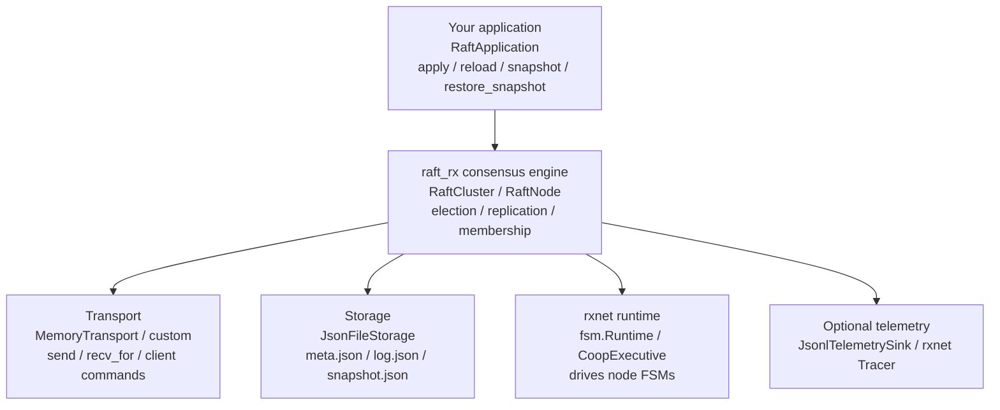

# raft_rx - Python User Guide

---

# Part I - The Library

---

## 1. Overview

`raft_rx` is a Python package that implements the Raft consensus algorithm on
top of the `rxnet` FSM runtime. It provides:

- **Replicated state machine** - commands are appended to a distributed log,
  committed by majority quorum, and applied to your application in order.
- **Leader election** - deterministic tests via `ManualClock`, or wall-clock
  operation via `SystemClock`.
- **Membership changes** - joint-consensus reconfiguration through
  `request_membership_change`.
- **Persistent storage** - term, vote, log, snapshot and membership
  configuration are stored as JSON files.
- **Pluggable transport** - the package includes deterministic in-memory
  transport; the standalone demo shows an HTTP transport.
- **Pluggable application** - implement a small protocol to attach your own
  state machine.
- **Optional observability** - JSONL telemetry and `rxnet` trace export can be
  enabled per cluster.

---

## 2. Architecture



| Layer | Type | Responsibility |
|---|---|---|
| Application | `RaftApplication` | Your state machine: what commands mean |
| Consensus engine | `RaftCluster` / `RaftNode` | Raft protocol, log replication and membership |
| Transport | `MemoryTransport` or compatible object | Deliver Raft messages and client commands |
| Storage | `JsonFileStorage` | Durable protocol state and snapshots |
| Runtime | `rxnet.fsm.Runtime` | Ticks the Raft FSMs |
| Telemetry | `JsonlTelemetrySink` / `NullTelemetrySink` | Optional structured events |

---

## 3. Key Concepts

### Roles

Every running node is in one of three roles:

| Role | Description |
|---|---|
| `FOLLOWER` | Accepts log entries and votes in elections |
| `CANDIDATE` | Requests votes after its election timeout expires |
| `LEADER` | Accepts client commands, replicates and commits them |

### Log, Terms and Commit

- Each client command becomes a `LogEntry(index, term, command, leader_id)`.
- The leader replicates entries to a quorum, then advances `commit_index`.
- Committed entries are applied through your application's `apply` method.
- `term` is a monotonically increasing election epoch.

### Membership Configuration

Membership is represented by `ClusterConfiguration`:

- `old_members`: current stable set, or leaving set during joint consensus.
- `new_members`: joining set during joint consensus, otherwise `None`.
- `index`: log index where the configuration was written.

`mode()` returns `"stable"` or `"joint"`. During joint consensus, commit
requires a majority in both `old_members` and `new_members`.

---

## 4. Implementing an Application

Your application must implement the `RaftApplication` protocol:

```python
from raft_rx import Command


class RaftApplication:
    def apply(self, command: Command) -> None: ...
    def reload(self) -> None: ...
    def snapshot(self) -> object: ...
    def restore_snapshot(self, snapshot: object) -> None: ...
```

Commands are simple dataclasses:

```python
from raft_rx import Command

Command(op="set", key="color", value="blue")
Command(op="delete", key="color")
```

| Method | When it is called | What it should do |
|---|---|---|
| `apply` | Once per committed log entry, in index order | Mutate application state |
| `reload` | Restart with no snapshot | Reset or reload the empty/base state |
| `snapshot` | Log compaction | Return a JSON-serializable snapshot object |
| `restore_snapshot` | Restart from snapshot | Restore state from the snapshot object |

Correctness rule: mutate replicated state only from `apply`. Reads can inspect
the local applied state, but writes must enter the leader's log.

### Example: Key-Value Application

```python
import json
from pathlib import Path

from raft_rx import Command


class KVApp:
    def __init__(self, path: Path) -> None:
        self.path = path
        self.path.parent.mkdir(parents=True, exist_ok=True)
        self.data: dict[str, str] = {}
        self.reload()

    def reload(self) -> None:
        if self.path.exists():
            self.data = {
                str(k): str(v)
                for k, v in json.loads(self.path.read_text()).items()
            }
        else:
            self.data = {}

    def apply(self, command: Command) -> None:
        if command.op == "set":
            if command.value is None:
                raise ValueError("set requires value")
            self.data[command.key] = command.value
        elif command.op == "delete":
            self.data.pop(command.key, None)
        else:
            raise ValueError(f"unsupported op: {command.op}")
        self.path.write_text(json.dumps(self.data, indent=2, sort_keys=True))

    def get(self, key: str) -> str | None:
        return self.data.get(key)

    def snapshot(self) -> object:
        return dict(self.data)

    def restore_snapshot(self, snapshot: object) -> None:
        self.data = {str(k): str(v) for k, v in dict(snapshot).items()}
        self.path.write_text(json.dumps(self.data, indent=2, sort_keys=True))
```

The repository version in `python/examples/kv_app.py` also writes via a
temporary file and atomic replace.

---

## 5. Building a Cluster

Use `RaftCluster` for local deterministic simulations and tests.

```python
from pathlib import Path

from raft_rx import ManualClock, NodeConfig, RaftCluster
from raft_rx.cluster import ClusterNodePaths


root = Path("var/my-cluster")
cluster = RaftCluster(clock=ManualClock())
node_ids = ["n1", "n2", "n3"]

for i, node_id in enumerate(node_ids):
    peers = [peer for peer in node_ids if peer != node_id]
    cluster.add_node(
        NodeConfig(
            node_id=node_id,
            peers=peers,
            election_timeout_ms=150 + i * 100,
            heartbeat_interval_ms=50,
        ),
        ClusterNodePaths(
            storage_dir=root / "storage",
            telemetry_path=root / "telemetry" / f"{node_id}.jsonl",
        ),
        application=KVApp(root / "kv" / f"{node_id}.json"),
    )
```

`NodeConfig.initial_members` is optional. If omitted, the node starts with
`[node_id, *peers]`. Use an explicit list when you need all nodes to share a
particular initial ordering.

### Running Ticks

With `ManualClock`, each tick advances time explicitly:

```python
cluster.run(40, advance_ms=10)
leader = cluster.leader()
```

With `SystemClock`, use an `rxnet` executive, as shown by the standalone demo:

```python
from rxnet.coop import CoopExecutive

executive = CoopExecutive()
executive.add(cluster.runtime)
executive.run()
```

---

## 6. Submitting Commands

Commands must reach the leader to be committed.

```python
from raft_rx import Command

leader = cluster.leader()
if leader is None:
    raise RuntimeError("no leader")

leader.submit_command(Command(op="set", key="color", value="blue"))
cluster.run(30, advance_ms=10)
```

`RaftCluster.submit_to_leader` is a convenience wrapper:

```python
ok = cluster.submit_to_leader(Command(op="delete", key="color"))
```

If a command is submitted to a follower in the core in-memory transport, that
follower drains and rejects it. Production-style forwarding belongs in the
application or transport layer; the standalone HTTP demo implements that.

---

## 7. Membership Changes

Call `request_membership_change` on the current leader with the full target
member list, not a delta.

```python
leader = cluster.leader()
if leader is None:
    raise RuntimeError("no leader")

cluster.provision_node("n4", members=["n1", "n2", "n3", "n4"], running=True)
leader.request_membership_change(["n1", "n2", "n3", "n4"])
cluster.run(120, advance_ms=10)
```

To remove a node, omit it from the target list:

```python
leader.request_membership_change(["n1", "n2", "n3"])
```

Internally the membership FSM writes:

1. `cluster.enter_joint`
2. `cluster.leave_joint`

During the joint phase, quorum requires a majority from both old and new
configurations.

---

## 8. Storage Format

`JsonFileStorage(root, node_id)` stores files under `{root}/{node_id}/`:

```text
var/my-cluster/storage/
└── n1/
    ├── meta.json
    ├── log.json
    └── snapshot.json
```

### `meta.json`

Contains protocol metadata:

```json
{
  "commit_index": 2,
  "compaction_threshold": 32,
  "configuration_index": 0,
  "current_term": 1,
  "new_members": null,
  "old_members": ["n1", "n2", "n3"],
  "snapshot_last_included_index": 0,
  "snapshot_last_included_term": 0,
  "voted_for": "n1"
}
```

### `log.json`

Contains un-compacted log entries:

```json
[
  {
    "index": 1,
    "term": 1,
    "leader_id": "n1",
    "command": {"op": "set", "key": "color", "value": "blue"}
  }
]
```

### `snapshot.json`

Contains compaction metadata plus your application snapshot:

```json
{
  "application": {"color": "blue"},
  "last_included_index": 32,
  "last_included_term": 4
}
```

`JsonFileStorage` writes JSON via temp file plus replace.

---

## 9. Observability and Tracing

### JSONL Telemetry

Pass a telemetry path when adding each node:

```python
ClusterNodePaths(
    storage_dir=root / "storage",
    telemetry_path=root / "telemetry" / f"{node_id}.jsonl",
)
```

Each line is a JSON object with time, role, term, event and payload. The shell
command `events [NODE ...]` displays the last events.

### `rxnet` Trace

Enable tracing on the cluster:

```python
cluster = RaftCluster(clock=ManualClock(), trace_enabled=True)
```

Export the trace:

```python
cluster.export_trace(root / "trace.bin")
cluster.report_trace(root / "trace.html")
```

The example `python/examples/kv_reconfigure_trace.py` generates:

- `python/var/python-reconfigure-trace/trace.bin`
- `python/var/python-reconfigure-trace/trace.html`

---

## 10. Shell

Run the generic shell:

```bash
uv run --project python python/tools/raftsh.py
```

Run the KV shell:

```bash
uv run --project python python/examples/kv_shell.py
```

### Generic Commands

| Command | Description |
|---|---|
| `status` | Cluster status and per-node summary |
| `leader` | Current leader |
| `tick [N] [MS]` | Advance the simulation |
| `autotick [MS]` | Configure background ticking; `0` disables it |
| `stop NODE` | Stop a node |
| `start NODE` | Start a node |
| `restart NODE` | Stop and start a node |
| `members [NODE]` | Show stable or joint membership |
| `addnode NODE` | Provision and add a node via joint consensus |
| `rmnode NODE` | Remove a node via joint consensus |
| `log NODE` | Print local log entries and commit status |
| `maxlog [ENTRIES]` | Read or update compaction threshold |
| `dump` | Print summaries as JSON |
| `trace [PATH]` | Export `trace.bin` if tracing is enabled |
| `trace_report [PATH]` | Export an HTML trace report |
| `events [NODE ...]` | Show recent JSONL telemetry |
| `quit` / `exit` | Leave the shell |

### KV Commands

The KV shell registers additional commands:

| Command | Description |
|---|---|
| `set KEY VALUE` | Submit a replicated write to the leader |
| `get KEY [NODE]` | Read local applied state from a node |
| `delete KEY` | Submit a replicated delete to the leader |

---

# Part II - The Demo Application

---

## 11. Overview

`python/examples/demo_app` is a separate application that consumes `raft-rx` as
an external dependency. It is the best place to study how the library is used in
a real process boundary: each process hosts one Raft node, exposes an HTTP
transport, runs a local interactive CLI, persists its own state, and uses
`HOST:PORT` as the Raft node ID.

It is **one possible application** of the library, not the library itself. Read
Part I to understand the core API; read this part to run and inspect a complete
multi-process key-value service.

### What the demo app adds on top of raft-rx

| Concern | How the demo app handles it |
|---|---|
| State machine | `DemoKVApp`, a persisted key-value application |
| Transport | HTTP transport implemented with the Python standard library |
| Executor | `rxnet.coop.CoopExecutive` driving the Raft node and CLI FSM |
| Command routing | Followers forward writes to the known leader |
| Node identity | The advertised `HOST:PORT` string is also the Raft node ID |
| API surface | Local CLI plus REST endpoints for clients and peer nodes |

### Source layout

```text
python/examples/demo_app/
├── pyproject.toml
├── README.md
└── src/raft_rx_demo/
    ├── demo.py       process wiring, HTTP server, runtime and REST API
    ├── app.py        replicated key-value application
    ├── transport.py  HTTP transport and REST client helpers
    └── cli.py        interactive CLI FSM
```

The demo intentionally keeps transport, application logic and CLI wiring in
separate modules. That makes it easier to replace one concern at a time in your
own application.

---

## 12. Running the Demo

Run commands in this section from the `python/` directory.

Start the first node:

```bash
uv run --project examples/demo_app raft-rx-demo --bind 127.0.0.1:7400
```

Start a second node and ask it to join the first:

```bash
uv run --project examples/demo_app raft-rx-demo \
  --join 127.0.0.1:7400 \
  --bind 127.0.0.1:7401
```

Start a third node the same way:

```bash
uv run --project examples/demo_app raft-rx-demo \
  --join 127.0.0.1:7400 \
  --bind 127.0.0.1:7402
```

Each process opens an interactive prompt. After election, one node becomes
leader. You can check from any prompt:

```text
status
members
```

Submit a write from any node:

```text
set color blue
```

If the local node is a follower, the demo forwards the write to the leader.
Reads are local:

```text
get color
```

A local read returns the state already applied on that process. In a healthy
cluster it quickly converges on all nodes, but it is not a linearizable read
protocol by itself.

Useful flags:

| Flag | Description |
|---|---|
| `--bind HOST:PORT` | Address to bind and advertise as node ID |
| `--join HOST:PORT` | Existing node to join at startup |
| `--data-dir DIR` | Persistent state directory |
| `--tick-ms MS` | Runtime tick period; default `25` |

By default, data is stored under `var/demo/<host>_<port>`. Use `--data-dir`
when you want predictable paths for examples or tests.

---

## 13. Restarting a Node

Stop one process with `quit`, then restart it with the same bind address and
data directory:

```bash
uv run --project examples/demo_app raft-rx-demo --bind 127.0.0.1:7401
```

The node reloads its durable Raft state and local KV snapshot from disk. It
does not need to be re-added if it was still a member of the cluster when it
stopped; the member IDs are `HOST:PORT` addresses, so the HTTP transport can
contact peers directly from the persisted membership configuration.

A three-node cluster remains available while one node is offline. If the leader
is stopped, the remaining voters elect a new leader after the election timeout.

---

## 14. Adding and Removing Nodes

### Adding a node at startup

The simplest way to add a new process is `--join`:

```bash
uv run --project examples/demo_app raft-rx-demo \
  --join 127.0.0.1:7400 \
  --bind 127.0.0.1:7403
```

The introducer forwards the join request through the cluster, peers learn the
new address, and the leader submits a membership change. The new node becomes a
voting member once the joint-consensus transition finishes.

### Adding a node from the CLI

If the target process is already running, use `addnode` from any prompt:

```text
addnode 127.0.0.1:7403
```

The command is forwarded to the leader if necessary.

### Removing a node

Remove a node by passing the node ID, which is its `HOST:PORT` string:

```text
rmnode 127.0.0.1:7403
```

The demo sends a full target membership list to `request_membership_change`.
Internally the Raft engine appends `cluster.enter_joint` and
`cluster.leave_joint` entries, so the same safety rules described in Part I
apply.

---

## 15. Joining and Merging Running Clusters

`join HOST:PORT` makes the current node join the cluster reachable at the
target address:

```text
join 127.0.0.1:7400
```

Use `join` when a single process should become a member of an existing cluster.

`merge HOST:PORT` is different: it combines two independent clusters. Run it
from any node in cluster A and point it at any node in cluster B:

```text
merge 127.0.0.1:7500
```

The two sides exchange their known members and addresses, then each leader
requests the union of both member sets. Use `merge` for demos where two
clusters were started independently and should become one cluster.

---

## 16. CLI Reference

### Key-value commands

| Command | Description |
|---|---|
| `set KEY VALUE` | Replicated write; forwarded to the leader if needed |
| `get KEY` | Local read from the applied KV state |
| `delete KEY` | Replicated delete; forwarded to the leader if needed |

### Cluster inspection

| Command | Description |
|---|---|
| `status` | Local role, term, leader, log length and commit index |
| `members` | Current stable or joint membership configuration |
| `log [LIMIT]` | Local Raft log, optionally limited to the last entries |

### Cluster management

| Command | Description |
|---|---|
| `addnode HOST:PORT` | Add a node ID/address to membership |
| `rmnode HOST:PORT` | Remove a node ID/address from membership |
| `join HOST:PORT` | Join the target cluster |
| `merge HOST:PORT` | Merge this cluster with another cluster |
| `stop` / `start` | Stop or resume local Raft processing |
| `quit` | Stop the process |

---

## 17. REST API

The same process exposes HTTP endpoints on `--bind`. Client-facing endpoints
are useful for simple scripts; Raft protocol endpoints are used by peer nodes.

### Client and inspection endpoints

| Endpoint | Method | Purpose |
|---|---|---|
| `/status` | GET | Local node summary |
| `/cluster/config` | GET | Membership configuration |
| `/log?limit=N` | GET | Local log entries |
| `/kv/<KEY>` | GET | Local KV read |
| `/kv/set` | POST | Replicated `set`; body `{"key": "...", "value": "..."}` |
| `/kv/delete` | POST | Replicated delete; body `{"key": "..."}` |
| `/cluster/add-node` | POST | Add a node; body `{"node": "HOST:PORT"}` |
| `/cluster/remove-node` | POST | Remove a node; body `{"node": "HOST:PORT"}` |
| `/cluster/join` | POST | Add caller node to the cluster |
| `/cluster/membership-request` | POST | Request a target member list |
| `/cluster/merge` | POST | Merge membership with another cluster |
| `/node/stop` | POST | Stop local Raft processing |
| `/node/start` | POST | Resume local Raft processing |

### Raft transport endpoints

| Endpoint | Method | Purpose |
|---|---|---|
| `/raft/message` | POST | Incoming Raft protocol message |
| `/raft/client-command` | POST | Forwarded client command |

For example:

```bash
curl -s http://127.0.0.1:7400/status
curl -s -X POST http://127.0.0.1:7400/kv/set \
  -H 'content-type: application/json' \
  -d '{"key": "color", "value": "blue"}'
curl -s http://127.0.0.1:7401/kv/color
```

---

## 18. Demo Troubleshooting

### The joining node stays alone

- Check that `--join` points to a running node.
- Check that both processes can reach each other's `--bind` addresses.
- Run `members` and `log` on the introducer to see whether the membership
  entries were committed.

### Writes work on one node but reads look stale elsewhere

- `get KEY` is a local read. Wait a few ticks or inspect `status` to confirm
  the follower has applied the committed entry.
- Use the leader for read-after-write demos when you need immediate feedback.

### A restarted node has unexpected old data

- Check the default data directory: `var/demo/<host>_<port>`.
- Use a fresh `--data-dir` for isolated experiments.

---

# Part III - Reference

---

## 19. Public API Reference

### Package Exports

```python
from raft_rx import (
    ClusterConfiguration,
    Command,
    JsonFileStorage,
    JsonlTelemetrySink,
    LogEntry,
    ManualClock,
    MemoryTransport,
    Message,
    MessageKind,
    NodeConfig,
    NullTelemetrySink,
    RaftApplication,
    RaftCluster,
    RaftNode,
    RaftShell,
    Role,
    SystemClock,
)
```

### `NodeConfig`

| Field | Type | Description |
|---|---|---|
| `node_id` | `str` | Unique node identifier |
| `peers` | `list[str]` | Other nodes the node can talk to |
| `election_timeout_ms` | `int` | Base election timeout |
| `heartbeat_interval_ms` | `int` | Leader heartbeat interval; default `50` |
| `initial_members` | `list[str] \| None` | Explicit initial membership; defaults to node plus peers |

### `RaftCluster`

| Method | Description |
|---|---|
| `add_node(config, paths, application, period_us=0)` | Add a node and register its FSMs |
| `provision_node(node_id, members, running=False, election_timeout_ms=450)` | Create a node during reconfiguration |
| `tick(advance_ms=10)` | Advance one runtime tick |
| `run(ticks, advance_ms=10)` | Advance several ticks |
| `leader()` | Return the current leader or `None` |
| `submit_to_leader(command)` | Submit to the current leader if one exists |
| `summaries()` | Return per-node status dictionaries |
| `stop_node(node_id)` / `start_node(node_id)` / `restart_node(node_id)` | Lifecycle helpers |
| `export_trace(path)` / `report_trace(path)` / `serve_trace(...)` | Trace helpers |

### `RaftNode`

| Method / property | Description |
|---|---|
| `role` | Current `Role` |
| `submit_command(command)` | Enqueue a client command for this node |
| `request_membership_change(members)` | Request full target membership |
| `summary()` | Return a status dictionary |
| `last_committed_command()` | Return the last applied command if available |
| `stop()` / `start()` | Local node lifecycle |

---

## 20. Building and Testing

Run the library tests:

```bash
uv run --project python --extra dev pytest -q
```

Run the standalone demo tests:

```bash
uv run --project python/examples/demo_app --extra dev pytest -q
```

Build the standalone demo package:

```bash
cd python/examples/demo_app
uv build
```

---

## 21. Troubleshooting

### No leader is elected

- Ensure every node has the same initial membership.
- Use staggered election timeouts in deterministic examples.
- Advance enough simulated time with `cluster.run(...)`.
- Check whether nodes were stopped through `stop_node` or `node.stop()`.

### Commands are not committed

- Submit writes to the leader, or use a layer that forwards to the leader.
- Run enough ticks after submission.
- Check `status`, `leader`, and `log NODE` in the shell.

### A joining node does not participate

- In in-memory clusters, call `cluster.provision_node(...)` before requesting
  the membership change.
- Pass the full target member list to `request_membership_change`.
- Run until the cluster returns to stable membership.

### Snapshot restore misses state

- Ensure `snapshot()` returns the complete application state.
- Ensure the returned object is JSON-serializable when using `JsonFileStorage`.
- Keep all state mutation inside `apply` and `restore_snapshot`.
